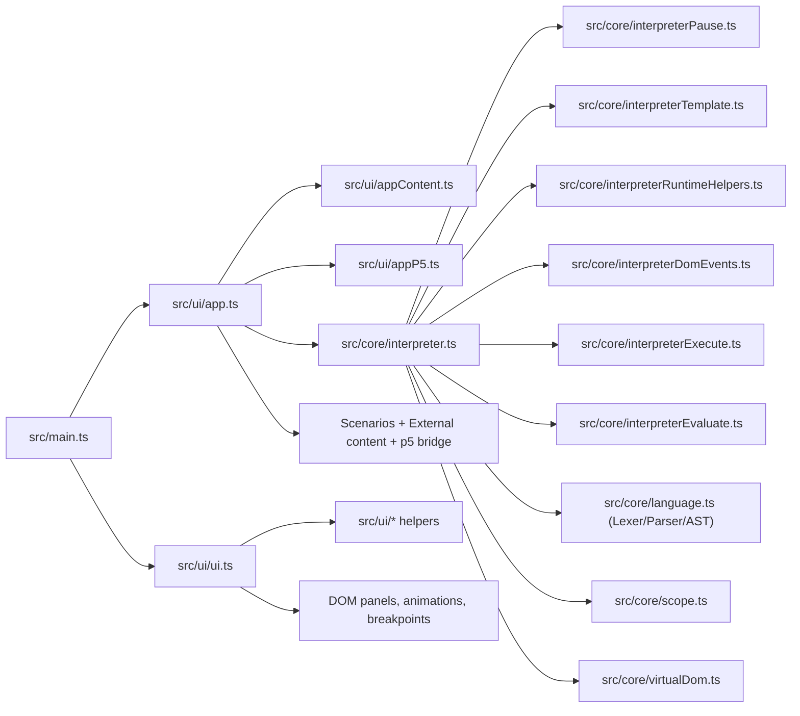

# HTMLJavascriptVisualizer

Interactive JavaScript execution visualizer with step-by-step runtime animation, memory inspection, and virtual DOM rendering.

## Features

- Step execution controls: run, pause, stop, next-step, speed control.
- Breakpoints per line with drag selection and soft breakpoints.
- Multiple stepping modes: `micro`, `instruction`, and `automatic`.
- Live code visualization with token highlighting and value propagation animations.
- Memory panel with scopes, variable values, array references, and type/address metadata toggles.
- Console panel with structured object tree rendering.
- Virtual DOM support:
- tree view with attribute-level highlighting,
- render preview in iframe,
- animated DOM read/write/mutation flows.
- Multi-editor workflow for `js`, `html`, and `css` sources.
- Scenario loader and external content loading API (`window.loadVisualizerContent`).
- Embedding controls for host pages (flow toggles, load button visibility, step mode).
- Optional p5-compatible runtime bridge (draw loop and command forwarding).

## Quick Start

```bash
npm install
npm run dev
```

Open the local Vite URL shown in terminal.

## Commands

- `npm run dev`: start development server.
- `npm run test`: run Vitest suite.
- `npm run build`: production build.
- `npm run build:student`: build + duplicate output to `dist/javascriptEngineVisualizerMobile.html`.
- `npm run preview`: preview production build.

## Build Output

- Main artifact: `dist/index.html`
- Student artifact: `dist/javascriptEngineVisualizerMobile.html` (via `npm run build:student`)

## Architecture



### Source Map

- `src/main.ts`: application bootstrap, global window API bindings, desktop/mobile panel interactions.
- `src/core/language.ts`: tokenizer + parser + AST node definitions.
- `src/core/interpreter.ts`: main runtime evaluator/orchestrator and AST execution flow.
- `src/core/interpreterPause.ts`: pause/step gating and pedagogical stack helpers.
- `src/core/interpreterTemplate.ts`: template-literal parsing, token rendering, and incremental template evaluation.
- `src/core/interpreterRuntimeHelpers.ts`: runtime error formatting + DOM/token helper utilities used by interpreter execution.
- `src/core/interpreterDomEvents.ts`: DOM event propagation helpers, inline handler execution, and callable invocation wrappers.
- `src/core/interpreterExecute.ts`: statement-level AST execution (`var`, assignment, loops, switch, return/break, call-as-statement).
- `src/core/interpreterEvaluate.ts`: expression-level AST evaluation (identifiers, members, calls, operators, function invocation flow).
- `src/core/scope.ts`: lexical scope model.
- `src/core/virtualDom.ts`: in-memory DOM model and DOM-like operations.
- `src/core/virtualDomParse.ts`: HTML-to-virtual-DOM parsing helpers with adapter hooks.
- `src/core/virtualDomQuery.ts`: selector parsing/matching and DOM traversal helpers (`querySelector`, `getElementById`, parent lookup).
- `src/core/virtualDomSerialize.ts`: virtual DOM to HTML string serialization helpers.
- `src/core/scenarios.ts`: predefined learning/demo scenarios.
- `src/ui/app.ts`: high-level app controller (editor modes, run lifecycle, scenarios, embed options, p5 mode).
- `src/ui/appContent.ts`: editor-mode and external-content normalization/parsing helpers.
- `src/ui/appP5.ts`: p5 runtime document generation and p5 orchestration methods (attached to `app`).
- `src/ui/ui.ts`: main UI state + panel rendering + animation orchestration.
- `src/ui/editor.ts`: textarea/editor behaviors (indentation, undo/redo, refresh).
- `src/ui/icons.ts`: icon rendering and refresh helpers.

### UI Module Split (recent refactor)

`src/ui/ui.ts` was decomposed into focused helper modules to reduce file size and improve maintainability:

- `src/ui/markup.ts`: HTML escaping + JS template token rendering + HTML/CSS code rendering.
- `src/ui/valueFormatting.ts`: runtime value formatting for code/memory tooltips and metadata.
- `src/ui/consoleTree.ts`: structured console value tree renderer + stack filtering.
- `src/ui/domHelpers.ts`: virtual DOM tree markup, inline DOM value chips, DOM path helpers.
- `src/ui/flowGuide.ts`: animated flow-line overlay primitives.
- `src/ui/executionControls.ts`: breakpoints, pause logic, and step-mode controls attached to `ui`.
- `src/ui/domAnimationPanel.ts`: DOM panel rendering and DOM mutation/read/write animation methods attached to `ui`.
- `src/ui/memoryPanel.ts`: memory snapshot rendering and array/memory highlight methods attached to `ui`.
- `src/ui/tokenAnimations.ts`: token/value flow animations and token replacement lifecycle methods attached to `ui`.
- `src/ui/uiOptions.ts`: options popup open/close/position behavior attached to `ui`.
- `src/ui/uiTooltips.ts`: code/memory tooltip and detached portal behaviors attached to `ui`.
- `src/ui/uiLayout.ts`: drawer/tab/mobile-tools layout methods attached to `ui`.

### Interpreter Module Split (recent refactor)

`src/core/interpreter.ts` now delegates focused concerns to dedicated modules:

- `src/core/interpreterPause.ts`: step/pause control policy and suppression handling.
- `src/core/interpreterTemplate.ts`: template literal segment parsing + progressive interpolation rendering.
- `src/core/interpreterRuntimeHelpers.ts`: runtime error normalization and shared expression/token helpers.
- `src/core/interpreterDomEvents.ts`: DOM click/event propagation and inline/callable handler execution.
- `src/core/interpreterExecute.ts`: statement execution engine extracted from `Interpreter.execute()`.
- `src/core/interpreterEvaluate.ts`: expression evaluation engine extracted from `Interpreter.evaluate()`.

## Runtime Lifecycle

1. `main.ts` initializes UI and editor state.
2. `app.start()` creates an `Interpreter` with current `js/html/css` buffers.
3. Interpreter tokenizes/parses code and executes AST nodes.
4. Interpreter calls UI hooks (`renderCode`, `updateMemory`, `highlightLines`, DOM updates).
5. UI panels animate dataflow, memory updates, and virtual DOM mutations.
6. On completion, app stays event-ready for interactive callbacks (e.g. `onClick`).

## Embedding / Iframe API

Global methods exposed on `window`:

- `window.loadVisualizerContent(payload)`
- `window.setVisualizerContent(payload)` (alias)
- `window.setVisualizerEmbedOptions(options)`

### `loadVisualizerContent(payload)`

Supported payload fields:

- `js` or `code`: JavaScript source.
- `html` or `domHtml`: HTML source for virtual DOM.
- `css` or `domCss`: CSS source.
- `run`: auto-start execution after load.
- `clearConsole`: clear console before load.
- `label` / `source` / `title`: display label for load log.
- `editor` / `editorMode` / `startEditor`: initial editor tab (`js|html|css`).
- `tab` / `drawerTab` / `startTab` / `view`: initial drawer tab (`memory|console|dom`).
- `ui`: embed UI options object.

### `setVisualizerEmbedOptions(options)`

Common options:

- `readVisualizationMode`: `line | data | both`
- `flowLineEnabled`: boolean
- `dataFlowEnabled`: boolean
- `showFlowLineToggle`: boolean
- `showLoadButton`: boolean
- `stepMode`: `micro | instruction | automatic`
- `p5ModeEnabled` / `p5Enabled`: boolean
- `p5FrameRate` / `p5Fps`: number
- `p5DeltaTime` / `p5DeltaTimeMs`: number
- `p5FrameDelayMs`: number

Example:

```js
const iframe = document.getElementById('viz');
iframe.contentWindow.loadVisualizerContent({
  js: 'let a = 1; console.log(a);',
  html: '<body><h1 id="title">Demo</h1></body>',
  css: 'h1 { color: #2563eb; }',
  run: false,
  ui: {
    readVisualizationMode: 'both',
    showFlowLineToggle: true,
    showLoadButton: false
  }
});
```

## Testing

- Test framework: Vitest.
- Current tests: interpreter-focused regression tests in `tests/interpreter.test.ts`.
