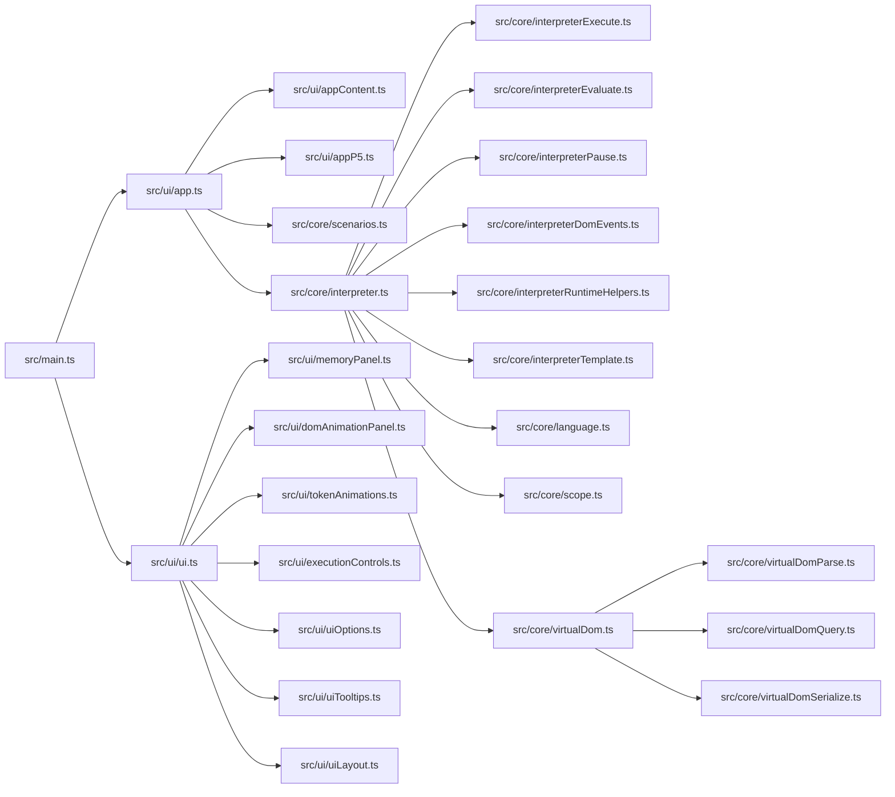

# HTMLJavascriptVisualizer

Interactive JavaScript execution visualizer with step-by-step runtime animation, memory inspection, and virtual DOM rendering.

## Features

- Step execution controls: run, pause, stop, next-step, speed control.
- Two step modes: `micro`, `instruction`.
- Breakpoints per line, including range breakpoints and soft breakpoints.
- Multi-editor workflow for `js`, `html`, and `css` sources.
- Runtime dataflow animations from code to memory and back.
- Memory panel with scope snapshots, value formatting, and optional metadata chips.
- Console panel with expandable object tree rendering.
- Virtual DOM tree + render preview + animated DOM read/write/mutation flows.
- Built-in scenario loader (all `saves/*.js` and `saves/*.html` are auto-discovered).
- Embed API for loading content and toggling visualizer options from parent pages.
- Optional p5-compatible runtime bridge (`draw` loop integration).

## Quick Start

```bash
npm install
npm run dev
```

Open the Vite URL printed in the terminal.

## Scripts

- `npm run dev`: start development server.
- `npm run build`: production build.
- `npm run build:student`: build and duplicate output to `dist/javascriptEngineVisualizerMobile.html`.
- `npm run preview`: preview production build.
- `npm run test`: run Vitest test suite.
- `npm run test:watch`: run Vitest in watch mode.

## Scenario Loading

Scenarios are defined by files in the `saves/` directory.

- Supported extensions: `.js`, `.html`
- Source of truth: filesystem (`import.meta.glob` in `src/core/scenarios.ts`)
- Ordering: numeric filename prefix first (for example `01-...`, `02-...`), then alphabetical
- Metadata overrides: specific files can customize labels and UI options (for example p5 scenario mode)

## Architecture



## Source Map

### Runtime Core (`src/core`)

- `language.ts`: lexer/parser and AST generation.
- `interpreter.ts`: runtime orchestrator.
- `interpreterExecute.ts`: statement execution engine.
- `interpreterEvaluate.ts`: expression evaluation engine.
- `interpreterPause.ts`: stepping and pause policy.
- `interpreterDomEvents.ts`: event propagation and handler execution.
- `interpreterRuntimeHelpers.ts`: shared runtime helper utilities.
- `interpreterTemplate.ts`: template-literal evaluation helpers.
- `scope.ts`: lexical scope model.
- `virtualDom.ts`: virtual DOM document model and operations.
- `virtualDomParse.ts`: HTML parsing into virtual nodes.
- `virtualDomQuery.ts`: selector traversal/matching utilities.
- `virtualDomSerialize.ts`: virtual node serialization.
- `scenarios.ts`: scenario discovery and scenario metadata normalization.

### UI Layer (`src/ui`)

- `app.ts`: app lifecycle, editor modes, scenario apply/load, embed options.
- `appContent.ts`: external payload normalization and editor buffer helpers.
- `appP5.ts`: p5 runtime bridge methods.
- `ui.ts`: central UI state and wiring.
- `memoryPanel.ts`: memory tree rendering and focus animations.
- `domAnimationPanel.ts`: DOM panel rendering and mutation animations.
- `tokenAnimations.ts`: token/data flight animations and replacement effects.
- `executionControls.ts`: step mode + breakpoint control logic.
- `uiOptions.ts`: options panel open/close/position management.
- `uiTooltips.ts`: value tooltip and detached portal rendering.
- `uiLayout.ts`: drawer/tab/mobile layout management.
- `editor.ts`: editor behavior (indent/outdent, undo/redo, sync helpers).
- `markup.ts`, `valueFormatting.ts`, `consoleTree.ts`, `domHelpers.ts`, `flowGuide.ts`: rendering and visualization helpers.

### Styles (`src/styles`)

- `main.css`: style entrypoint that imports all style modules.
- `base.css`: theme tokens, global reset, root/body sizing behavior.
- `toolbar.css`: top controls, load/options popups, mode and speed controls.
- `editor.css`: editor region, line numbers, code layers, syntax highlighting.
- `mobile-tools.css`: mobile tool rows and touch-first tool controls.
- `drawer-dom.css`: right panel shell, drawer tabs, DOM panel and desktop rules.
- `memory-console.css`: memory panel and console panel styling.
- `animations.css`: runtime animation classes and keyframes.
- `scrollbars.css`: custom scrollbar theme for core panels.

## Runtime Lifecycle

1. `src/main.ts` boots UI/editor and binds global embed methods.
2. `app.start()` builds interpreter context from current `js/html/css` buffers.
3. Interpreter parses and executes AST nodes.
4. Runtime events feed UI updates (code highlighting, memory, DOM, console).
5. UI modules render panels and play animations.
6. Execution finishes, then event callbacks remain available for interaction.

## Embed API

Global methods exposed on `window`:

- `window.loadVisualizerContent(payload)`
- `window.setVisualizerContent(payload)` (alias)
- `window.setVisualizerEmbedOptions(options)`

### `loadVisualizerContent(payload)`

Common fields:

- Code sources: `js`/`code`, `html`/`domHtml`, `css`/`domCss`
- Run control: `run`, `clearConsole`
- Labels: `label`, `source`, `title`
- Initial views: `editor`/`editorMode`/`startEditor`, `tab`/`drawerTab`/`startTab`/`view`
- UI options: `ui`

### `setVisualizerEmbedOptions(options)`

Common options:

- Read visualization: `readVisualizationMode` (`line | data | both`)
- Toggles: `flowLineEnabled`, `dataFlowEnabled`, `showFlowLineToggle`, `showLoadButton`
- Step mode: `stepMode` (`micro | instruction`)
- p5 options: `p5ModeEnabled`, `p5FrameRate`, `p5DeltaTime`, `p5FrameDelayMs`

## Testing

- Framework: Vitest
- Main tests: `tests/interpreter.test.ts`
